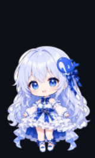
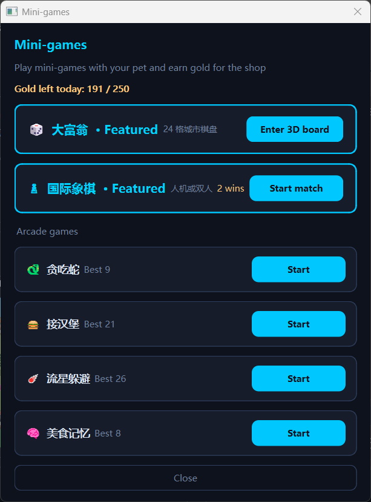
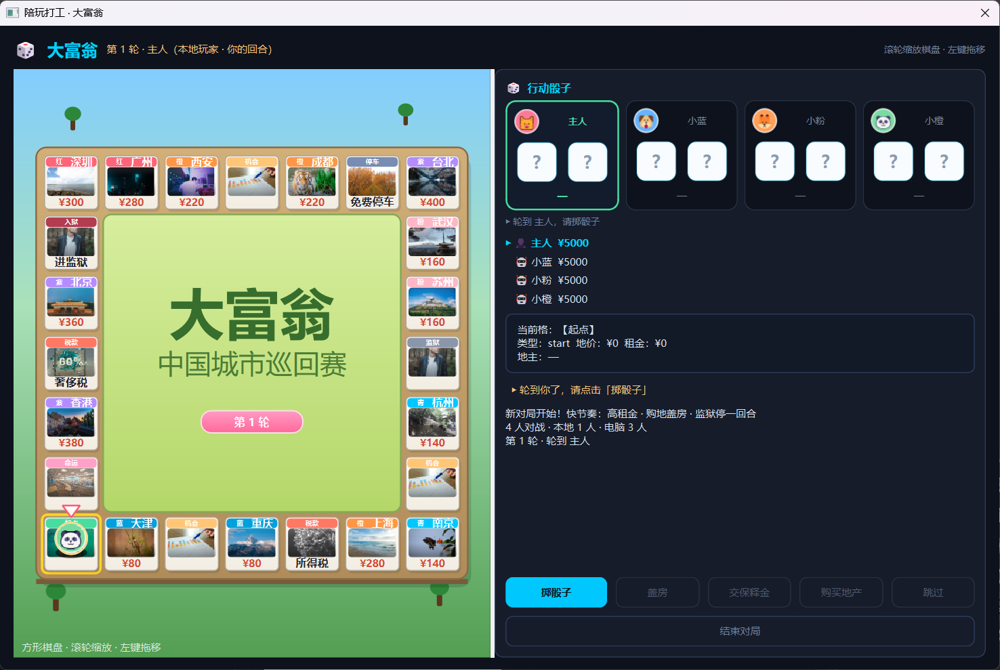
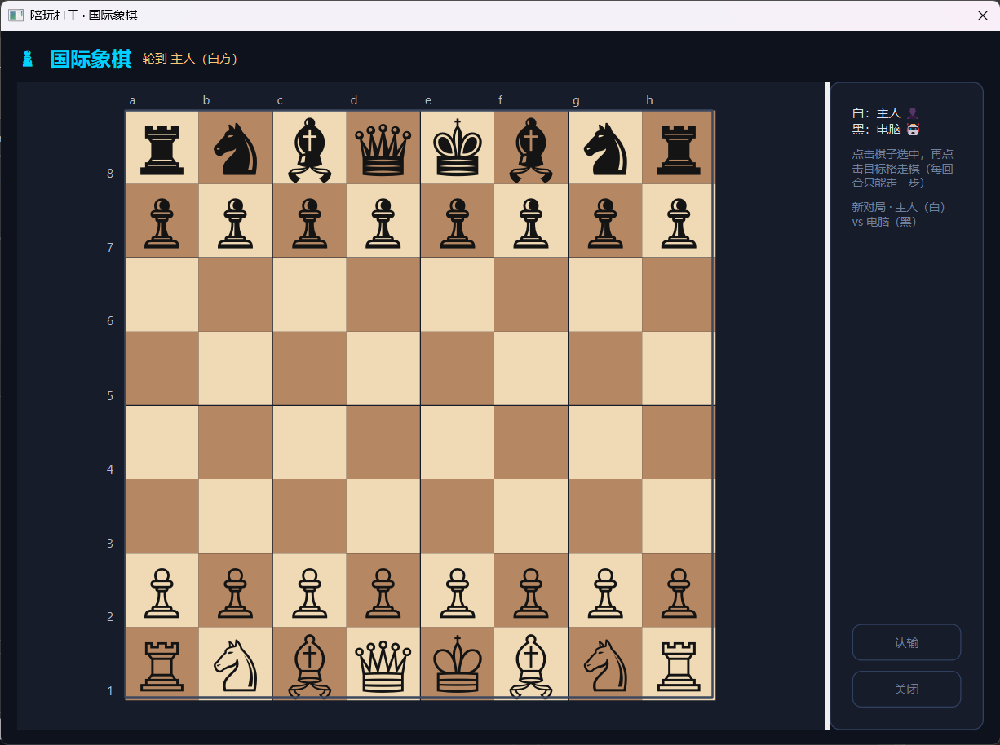
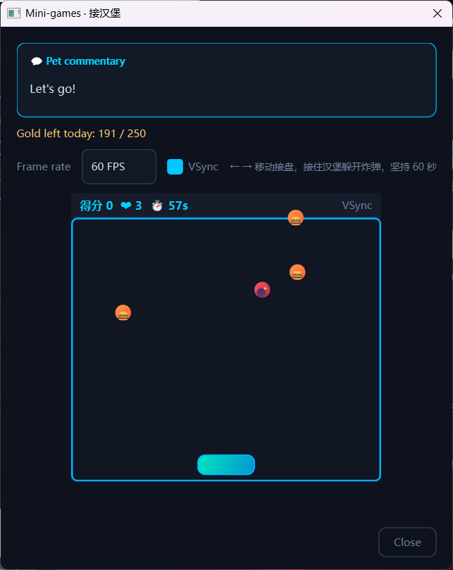

# Desktop Pet

A transparent, always-on-top **desktop companion** for Windows — idle animations, speech bubbles, hunger/mood stats, a small shop economy, and a bundle of mini-games including **Monopoly** and **Chess**.

> Fan-made desktop pet project. **Not** affiliated with DeepSeek or any official brand.  
> Source code is MIT-licensed; verify you have rights to redistribute character art before publishing builds.

---

## Screenshots

| Desktop pet | Mini-game hub | Monopoly board |
|:---:|:---:|:---:|
|  |  |  |

| Chess | Arcade games |
|:---:|:---:|
|  |  |

---

## Features

| Module | Highlights |
|--------|------------|
| **Pet** | Frameless transparent window, drag & click, system tray, multi-pet support |
| **Stats** | Hunger, mood, intimacy level — auto-saved |
| **Economy** | Shop, backpack, feed consumables, daily gold cap |
| **Arcade** | Snake, catch burgers, meteor dodge, memory match |
| **Monopoly** | 24-tile Chinese city board, property, cards, jail, SFX |
| **Chess** | vs AI or local two-player, background engine thread |

**Languages:** English (default), 简体中文, 繁體中文, 日本語, 한국어, Español, Français, Deutsch, Italiano, Português, Русский, العربية, हिन्दी, ไทย, Tiếng Việt, Türkçe, Polski, Nederlands — change in **Settings** (tray menu or right-click the pet).

Chinese feature guide: [docs/zh-CN/FEATURES.md](docs/zh-CN/FEATURES.md) · [README.zh-CN.md](README.zh-CN.md)

---

## Quick start (Windows)

### Requirements

- **Python 3.10+** (3.11 recommended)
- **Windows 10/11**

### Install

```powershell
cd DesktopPet
python -m venv .venv
.venv\Scripts\activate
pip install -r requirements.txt
```

### Run

Double-click **`start.bat`** (or `启动宠物.bat`), or:

```powershell
python src\main.py
```

If `skins/default/` is missing, run **`rebuild-skins.bat`** (`重建皮肤.bat`) when you have source sprites under `人物序列图/`.

**Quit completely:** tray icon → Quit, or **`stop-desktop-pet.bat`** (`停止桌宠.bat`).

Save data: `%APPDATA%\DesktopPet\` (Windows) or `~/.config/DesktopPet/` (Linux/macOS).

---

## Controls

- **Left-click** pet — speech bubble  
- **Drag** — grab / fall animation  
- **Right-click** — feed, pet, shop, mini-games, **Settings → Language**  
- **Tray** — left-click show/hide pets  

Closing the pet window hides it to the tray; it is not the same as quitting.

---

## Project layout

```
DesktopPet/
├── start.bat / 启动宠物.bat
├── src/
│   ├── main.py
│   ├── i18n/locales/     # 18 languages
│   ├── ui/               # pet window, shop, game hub, settings
│   ├── games/            # arcade + richman + chess
│   └── config/
├── skins/default/        # baked sprite frames
├── assets/richman/       # board audio & art
├── docs/screenshots/
├── tools/build_skins.py  # rebuild skins (needs local 人物序列图/)
└── tests/
```

---

## Development

```powershell
pip install -r requirements.txt
python -m unittest discover -s tests -v
```

Set `DEV_MODE = False` in `src/utils/constants.py` before release (already off by default).

---

## Third-party assets

- Monopoly SFX / UI: [Kenney](https://kenney.nl/) **CC0**
- City images: [assets/richman/cities/SOURCES.md](assets/richman/cities/SOURCES.md)
- Chess logic: [python-chess](https://github.com/niklasf/python-chess)

See [assets/richman/README.md](assets/richman/README.md) for details.

---

## License

[MIT License](LICENSE) for source code. Bundled game assets follow their respective directory licenses. Do not use Hasbro Monopoly trademarks for commercial infringement.
